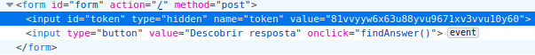
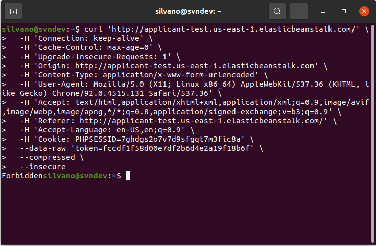
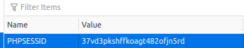
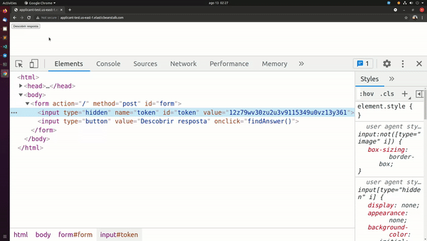
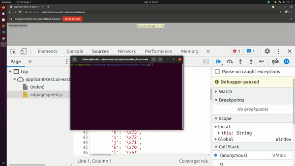

# Test Crawly

## Instalação
Primeiramente temos que instalar os pacotes necessários para o funcionamento do script:

```zsh
yarn install
```
ou

```zsh
npm install
```

Agora que os pacotes foram instalados é só rodar o comando
```zsh
node index.js
```

## Passo a passo
### Vou breve explicação de como cheguei no resultado final

1. Meu primeiro passo foi entrar na [url enviada no e-mail](http://applicant-test.us-east-1.elasticbeanstalk.com) e entender o que eu precisa fazer manualmente para ter acesso a informação necessária.
2. Ao abrir a página, tinha apenas um botão escrito **Descobrir resposta**  e sendo assim logo fui fazer alguns testes.
3. Ao clicar no botão **Descobrir resposta** ele envia uma requisição via **POST** e gera um número aleatório;
    - Meu primeiro pensamento foi, resolvi o problema =), preciso apenas enviar uma requisição via **POST** e pegar o resultado necessário, mas não foi bem isso que aconteceu;
4. Então decidi abrir o **DEVTOOLS** do browser e verificar como que o formulário estava enviando, olhando o HTML no formulário tem um **input[hidden]** com um token no value, então decidi enviar o formulário com o token e mesmo assim não deu certo, deu o erro **FORBIDDEN**;


5. Dicidi copiar o **CURL** da requisição via **POST** e tentar via terminal e vericar qual seria o resultado, mesmo assim deu resultado negativo, deu o mesmo erro **FORBIDDEN**, mas foi uma coisa boa, percebi que na requisição que enviei tem um header chamado **COOKIE** com uma sessão;


6. Então decidi abrir o storage do browser e verificar se estava sendo gravado algum tipo de cookie no navegador, então achei esse cookie e comparei com o header **COOKIE** que foi enviado e percebi que era semelhantes; 


7. Quando envio o formulário, o **COOKIE** que foi enviado é apagado e quando aperto no link de voltar ou atualizo a página é criado um novo cookie;

8. Mesmo enviando o formulário com o **TOKEN** e o **COOKIE** acontecia o mesmo problema, retornava o erro **FORBIDDEN** e foi aqui que fiquei algumas horinhas tentando entender o que eu estava fazendo de errado, mesmo enviando todas as informações corretas, as mesmas informações que estava sendo enviado via formulário e mesmo assim estava dando erro;

9. Até eu perceber que ao clicar para enviar o formulário, o **TOKEN** do input[hidden] é alterado e esse é o motivo que estava ocasionando o erro;


10. Achei o script que altera o token chamado **adpagespeed.js** e achei a função que fazia a mágica chamado **findAnswer()**

11. Prontinho, deu tudo certo =).


**OBS**: Tambem tive um pequeno probleminha com o Referer, quando o envio da URL é enviado sem a / no final, da erro, ex:

Se enviar a URL desse jeito no header Referer da erro:
- http://applicant-test.us-east-1.elasticbeanstalk.com

Para que isso não aconteça, tem que enviar a URL assim:
- http://applicant-test.us-east-1.elasticbeanstalk.com/

com a / no final.